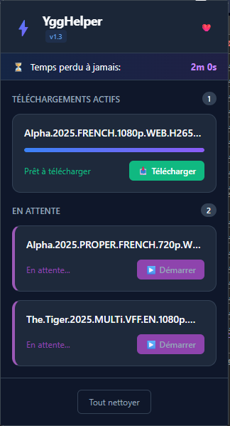

# ⚡ YggTorrent Helper (Smart Timer)

Une extension web optimisée pour YggTorrent qui gère intelligemment le temps d'attente de téléchargement pour vous permettre de naviguer librement. Plus besoin d'attendre 30 secondes devant votre écran !

## 🚀 Fonctionnalités

- **Smart Timer** : Lance automatiquement le compte à rebours de 30s côté serveur dès que vous arrivez sur la fiche d'un torrent.
- **File d'attente Intelligente** :
  - **Actifs** : Les téléchargements en cours de traitement.
  - **En attente** : Si vous ouvrez plusieurs onglets, les suivants sont mis en attente pour ne pas bloquer le système (un seul timer à la fois).
  - **Démarrage Manuel** : Lancez les téléchargements en attente d'un simple clic quand le précédent est fini.
- **Navigation Libre** : Grâce au Service Worker, le timer continue même si vous fermez l'onglet ou naviguez ailleurs.
- **Mises à jour Automatiques** : Système de notification intégré pour vous avertir des nouvelles versions disponibles sur GitHub.

## 📦 Installation

Cette extension n'est pas disponible sur le Chrome Web Store. Vous avez deux options pour l'installer.

### Option 1 : Via le fichier .crx (Recommandé)

1. **Télécharger l'extension** :
   - Rendez-vous dans la section [Releases](https://github.com/MoowGlax/ygg-helper-dl/releases) et téléchargez le dernier fichier `.crx`.

2. **Ouvrir les extensions** :
   - Dans votre navigateur, ouvrez la page de gestion des extensions :
     - Chrome : `chrome://extensions`
     - Opera : `opera://extensions`
     - Edge : `edge://extensions`

3. **Installer** :
   - Activez le **Mode développeur** (en haut à droite).
   - Glissez-déposez le fichier `.crx` téléchargé directement dans la page des extensions.
   - Acceptez l'installation si demandé.

### Option 2 : Via le code source (Développement)

1. **Télécharger le projet** :
   - Clonez ce dépôt ou téléchargez le fichier ZIP (Code > Download ZIP) et décompressez-le.
   
2. **Charger l'extension** :
   - Allez sur la page des extensions (`chrome://extensions`).
   - Activez le **Mode développeur**.
   - Cliquez sur **"Charger l'extension non empaquetée"** (Load unpacked).
   - Sélectionnez le dossier racine du projet.

## 🦊 Installation sur Firefox

**WIP** 

## 🛠️ Utilisation

1. Naviguez sur YggTorrent comme d'habitude.
2. Ouvrez la fiche d'un torrent.
3. Une notification discrète "⚡ Helper" apparaît en bas à droite pour confirmer la prise en charge.
4. Le timer démarre en arrière-plan. Vous pouvez continuer à naviguer !
5. Ouvrez l'extension (clic sur l'icône ⚡) pour voir l'état de vos téléchargements.
6. Une fois le timer terminé, cliquez sur "Télécharger" pour lancer le téléchargement.

## 🤝 Contribution

Les contributions sont les bienvenues ! N'hésitez pas à ouvrir une Issue ou une Pull Request.

## ⚠️ Avertissement

Ce projet est à but éducatif et personnel uniquement. L'auteur n'est pas responsable de l'utilisation qui en est faite. Assurez-vous de respecter les conditions d'utilisation des sites que vous visitez et les lois en vigueur dans votre pays concernant le téléchargement.
